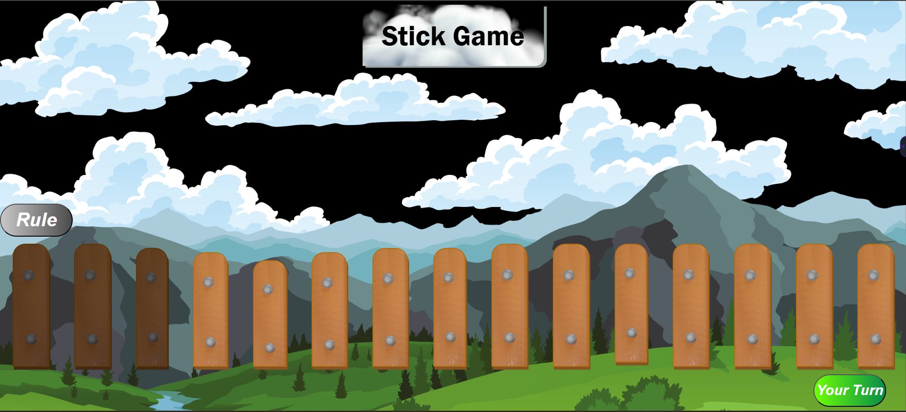

# Stick Game

## Project Overview

An interactive turn-based strategy game implementing the classic "take-away" stick game where players compete against an AI opponent. The game begins with 15 sticks, and players alternate turns removing 1 to 4 sticks. The computer employs an optimal winning strategy by ensuring the combined total of sticks removed per round equals 5, mathematically guaranteeing victory when properly executed.

Built using Node.js backend architecture with Express.js framework and Pug templating engine, this project demonstrates strategic AI implementation, game theory principles, and interactive web application development with server-side rendering capabilities.

## Project Structure

```
stick-game/
├── app.js                    # Express application entry point
├── package.json             # Dependencies and scripts
├── views/
│   ├── index.pug           # Home page template
├── static/
│   │   └── style.css       # Game styling and animations
│   │   └── index.js         # Client-side interaction logic
│   └── images/

```

## Technical Details

**Technology Stack:**
- **Backend**: Node.js, Express.js, Pug templating
- **Frontend**: HTML5, CSS3, JavaScript ES6+
- **Architecture**: MVC pattern with server-side rendering

**Core Features:**
- Turn-based gameplay with human vs AI mechanics
- Strategic AI using modular arithmetic (total % 5 = 0 strategy)
- Real-time game state synchronization
- Input validation for move constraints (1-4 sticks)
- Visual stick representation with removal animations
- Game outcome determination and replay functionality

## Data Flow Model

```


```

### Data Flow Components

**Server-Side Processing:**
- Express Router → Game Controller → AI Logic → Pug Template → HTML Response

**Client-Side Game Logic:**
- Player Input → Validation → State Update → AI Turn → Win Check

**AI Strategy Implementation:**
- Target: Make (Player Move + AI Move) = 5
- Winning Positions: Leave opponent with multiples of 5
- Guaranteed Victory: Control game flow through mathematical strategy

## User Interface

```


```

## How to Use and Play

### Installation
```bash
git clone https://github.com/chiragbansal511/stick-game.git
cd stick-game
npm install
npm start
```
Access at `http://localhost:80`

### Gameplay
1. Game starts with 15 sticks displayed
2. Choose 1-4 sticks to remove on your turn
3. Computer automatically makes its move using optimal strategy
4. Player who takes the last stick loses the game
5. Computer employs winning algorithm (sum of moves = 5)

### Controls & Features
- **Controls**: Click number buttons (1-4) to select move, new game button
- **Features**: AI opponent with winning strategy, move history, visual stick counter, turn indicators